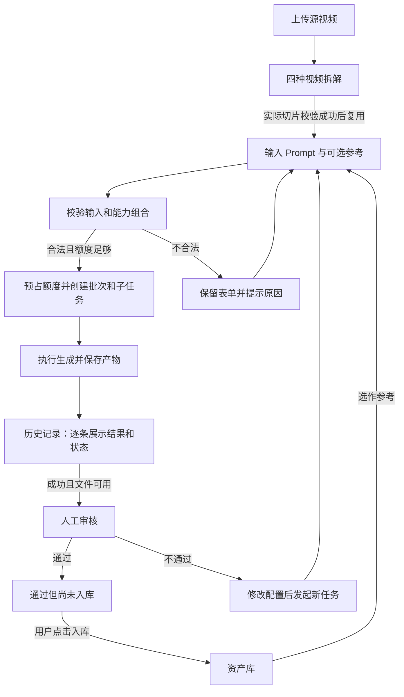
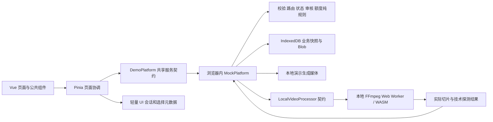
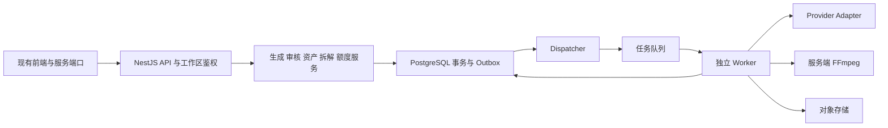

# 多模型 AI营销视频生产平台｜项目设计总览

> **公开归档版：2026-09-12 的 B0–B1 / UI2–UI10 设计交接快照。** 全文的“当前”、阶段边界、后续规划及测试数字均指该历史时点，不代表现在的 main 或 B2.1C 状态。当前实现与验收请从仓库 README 进入。
> 本版仅公开设计说明；本地运行证据、截图、日志、任务状态和原完整交付包未公开。现有源码链接指向公开基线，供定位结构使用，不证明历史描述与后来代码完全一致。

整理日期：2026-09-12。覆盖现有 B0–B1 方案及 UI2–UI10 调整；后端、真实模型和交付规划单独标注。本文是产品、设计、研发和评审共同使用的总入口，按“做什么 → 用户怎么用 → 规则怎么定 → 系统怎么实现 → 如何验证”组织。

**历史交接记录：当时工程已完成交互式模拟重建，并增加真实的浏览器本地视频处理。生成仍是 Mock，尚未完成 B2 真实后端、B3 真实模型接入、B4 客户验收。** 本文汇总已有决定，不新增业务要求；项目过去的客户事实与本次重建实现分别见事实基线（历史本地参考，未随公开版提供）和[实施报告](https://github.com/LYCMYT/AIspsc/blob/0d6d500a7a494082c6876bf9be1a081bc32c2a2a/IMPLEMENTATION_REPORT.md)。

## 1. 从哪里开始看

| 读者想知道什么 | 建议阅读 |
| --- | --- |
| 快速理解项目 | 本文第 2–4 节：目标、设计选择、五页与核心流程 |
| 了解交互和视觉 | 第 5 节 → 界面合同（历史本地参考，未随公开版提供） → 历史截图（本地记录未公开） |
| 核对业务规则 | 第 6–9 节 → 对应的输入、路由、切片、审核和额度合同 |
| 接手技术实现 | 第 10–11 节 → [领域合同](https://github.com/LYCMYT/AIspsc/blob/0d6d500a7a494082c6876bf9be1a081bc32c2a2a/docs/03_DOMAIN_CONTRACT.md)、API 设计（历史本地参考，未随公开版提供）与第 14 节代码入口 |
| 评估完成度与后续工作 | 第 12–13 节 → [实施报告](https://github.com/LYCMYT/AIspsc/blob/0d6d500a7a494082c6876bf9be1a081bc32c2a2a/IMPLEMENTATION_REPORT.md)、状态记录（本地记录未公开） |
| 查找公开说明与历史参考 | 第 14 节的公开索引；未公开参考明确标注 |

阅读旧文档时，按用户已确认要求、采用后的业务规格和对应修订核对。不能将初版 PRD、旧图片或较早 ADR 的限制直接当成当前实现。特别需要识别的修订见第 13 节。

## 2. 产品要解决什么问题

项目正式名称为“多模型 AI营销视频生产平台”，使用场景是电商投流视频素材生产。创作者输入想法，选填商品、模特、背景或参考视频，生成可供人工筛选和后续剪辑的短素材；通过逐条审核，将可用成果沉淀到资产库并再次复用。

产品围绕一条工作链设计：**创作 → 历史结果 → 人工审核 → 点击入库 → 资产复用**。视频拆解帮助准备参考片段，素材识别当前负责文件信息、预览和人工标签，服务于同一条工作链。

范围不包括自动拼成长片、投放平台连接、转化效果保证、自助充值或自动选择“最佳模型”。“生成数量”指单次配置产生 1–4 个独立结果，不是无限批量生产。5–15 秒是单条视频成片长度；不把生成耗时写成成片长度。产品需求原文（历史本地参考，未随公开版提供）

## 3. 关键设计选择及原因

| 选择 | 如何落地 | 解决的问题 |
| --- | --- | --- |
| 同一前端分阶段推进 | Vue 3 + TypeScript + Vite + Pinia，pnpm workspace；后续通过服务边界接 API | 避免展示版本和真实版本各维护一套输入、状态和业务规则 |
| 先校验规则，再匹配界面 | Prompt、素材角色、参数组合、切片长度和审核条件以合同为准 | 防止为了匹配旧图而改变业务含义 |
| 模型由规则分发 | 六类互斥任务、能力过滤、固定优先级；前台无模型选择器 | 创作者表达生产需求，内部保留可追溯的分发决策 |
| 一次请求、多个独立结果 | Batch 保存输入快照，Item 独立推进状态、额度、审核和入库 | 正确表达部分成功，防止整批共用审核结论 |
| 生成、审核、入库分开 | 成功进入历史；审核通过后还要点击入库 | 避免不可用或未确认成果直接混入资产库 |
| 文件与临时预览地址分开 | IndexedDB 保存 Blob；使用时创建并释放 Object URL | 刷新后可以恢复实际文件，缺文件时不会伪装可用 |
| Mock 与真实处理明确区分 | 生成使用标明演示的执行器；本地 FFmpeg 处理真实上传文件 | 保持可验证的交互，又不虚构模型能力和产物 |
| 正常页面精简，诊断按需展开 | 用户看到任务、参数、状态和操作；内部 ID、路由、哈希进入开发诊断 | 降低界面阅读负担，同时保留排查依据 |

设计决策原文：ADR 与开放问题（历史本地参考，未随公开版提供）。其中 T00 是栈与首轮范围的采用记录；之后的本地 FFmpeg、新建创作等以 UI9/UI10 的授权修订为准。

## 4. 五个页面怎样协作

| 页面 | 用户主要动作 | 当前结果与边界 |
| --- | --- | --- |
| 创作 `/create` | 输入 Prompt、选择参考角色、切换视频/图片/文案、设置参数、生成 | 普通入口展示最近记录；显式“新建创作”进入独立的当前轮工作区 |
| 资产库 `/assets` | 搜索、筛选、预览、整理标签、上传与复用素材 | 区分上传源、演示样例、切片和已审核生成结果；缺文件或审核失效时禁止相应复用 |
| 历史记录 `/history` | 查看批次和每条状态、重试/取消、审核、点击入库 | 全部生成任务的统一记录入口；审核在详情中完成，不增加一级审核页 |
| 视频拆解 `/decompose` | 直接上传视频、选择四种方式、拆解、预览、下载/用于创作 | 本地 FFmpeg 实际处理；底部视频轮播和对应帧来自实际文件 |
| 素材识别 `/recognize` | 直接上传、预览、查看文件参数、保存人工标签 | 当前没有自动识别商品或人物的模型；不提供虚构分析结论 |

生成过程中已经有任务记录。流程图中的“历史”是数据归属，不要求每次都跳转页面：UI10 新建创作内提交后留在 `/create` 展示本轮结果，历史页仍包含这些任务。

## 5. 页面和交互怎样设计

### 5.1 整体视觉

采用深蓝黑背景、深色面板、细边框与克制的蓝紫强调。五页统一导航、字号层级、圆角、间距、按钮和选中态；主题值集中在 [styles.css](https://github.com/LYCMYT/AIspsc/blob/0d6d500a7a494082c6876bf9be1a081bc32c2a2a/apps/web/src/styles.css)。桌面检查 1672×941、1440×900、1280×800；窄屏保留有可访问名称的图标导航。

旧图片只参考布局、色彩和空间关系，白底作品集海报不作为应用主题。即梦的公开页面和用户提供的图片用于研究输入区、参数组织与新建交互；不把其模型、价格、登录态行为当成本项目已验证能力。视觉研究与设计稿交接（历史本地参考，未随公开版提供）

### 5.2 创作输入区

- 上传入口和已选参考卡片位于 Prompt 上方，横向组织；卡片显示缩略图、角色、文件名和移除操作，窄屏保持可访问。
- 点击“上传素材”后打开角色选择弹窗，提供参考视频、模特、产品、背景；上传与从资产库选取沿用角色约束。
- 工具栏提供生成类型、参考方式、参数摘要、演示额度和生成操作。首尾帧入口按用户选择保留为禁用；“全能参考”对应已有四种角色。
- 参数层集中放置比例、分辨率、数量，以及当前模态的时长/音频或文案设置；选择即时反映到草稿，提交时仍做严格校验。
- 所有下拉和参数层向下展开，空间不足时调整滚动位置并允许面板内部滚动；不显示向下箭头，不提供独立“10s”入口或“应用到预览”按钮。
- 删除正常状态下的重复讲解、内部字段和“Prompt 必填 · 最多 5000 字”等常驻说明；必要的字段名称、错误、禁用态和演示标识保留。

### 5.3 新建创作

点击顶栏“新建创作”后，进入居中的空白输入区，清空 Prompt、参考与参数并聚焦；不展示旧任务和重复空态。若存在未提交内容，包括仅修改参数，先确认；已提交且未修改的内容直接新建。

这一轮的结果显示在“本次创作”，旧任务保留在历史。再次新建只清理草稿和当前轮视图，不删除资产、任务或额度流水。晚返回的旧上传/提交不得回填新草稿或抢走路由。正常存储条件下，切页和刷新恢复本轮已提交结果关联；不包含未提交草稿库。

### 5.4 上传、弹层与状态

视频拆解和素材识别都由直接上传开始，移除中间的资产选择和固定测试视频入口。点击选择和拖拽使用相同校验，显示读取中、错误和重新选择；选中文件后再展示实际信息与操作。

下拉支持方向键、Enter 和 Esc；模态弹窗圈定焦点，关闭后返回触发控件。错误靠文字表达，处理中只显示已知阶段，不编造百分比。演示环境和演示额度始终有明确标识。

全部修订见 02_UI_CONTRACT.md（历史本地参考，未随公开版提供）。历史视觉记录（截图保留在本机）：新建创作（本地记录未公开）、参数面板（本地记录未公开）、本轮结果（本地记录未公开）、分镜轮播（本地记录未公开）。

### 5.5 可编辑 HTML 设计面板

[design-panel.html](https://github.com/LYCMYT/AIspsc/blob/0d6d500a7a494082c6876bf9be1a081bc32c2a2a/apps/web/public/design-panel.html) 是独立设计预览。支持五页切换、普通文字原地编辑、有限区域的移动/缩放及样式调整、撤销/重做、JSON 导入和 HTML 导出，兼容已有 v1 修改稿。

它用于交换设计意见，不执行实际生成、审核、标签保存或 FFmpeg。用户修改后导出的文件是后续实现输入，不会自动更新 Vue 页面。面板记录到 UI9 的相关同步；UI10 新建工作区以实际应用、界面合同和对应截图为准。

## 6. 输入规则与六类任务

| 输入 | 规则 |
| --- | --- |
| Prompt | trim 后 1–5000 字符，三个模态均必填；上传素材不能绕过 |
| 参考 | `reference_video` 为视频；`person/product/background` 为图片；每个角色最多一个，必须存在且可用 |
| 视频 | 5–15 整数秒，默认 10；比例 9:16 / 16:9 / 1:1；720p / 1080p；音频开关默认关闭 |
| 生成数量 | 1–4，默认 1；每条产生独立子任务 |
| 图片/文案 | 图片不接受视频参考；文案不接受参考素材；参数按模态隔离 |
| 模型参数 | 请求中无 `modelId` 或 `referenceStrength`；非法字段和能力组合明确拒绝，不静默修正 |

校验分为结构校验与素材/组合语义校验。B1 的候选参数是演示能力集合，不是所有真实供应商的能力承诺。[严格请求 Schema](https://github.com/LYCMYT/AIspsc/blob/0d6d500a7a494082c6876bf9be1a081bc32c2a2a/contracts/generation-request.schema.json)、[请求测试向量](https://github.com/LYCMYT/AIspsc/blob/0d6d500a7a494082c6876bf9be1a081bc32c2a2a/fixtures/request-cases.json)

按下表从上到下确定任务类型，版本为 `routing-v2-rebuild`：

| 判断条件 | 任务类型 | 当前演示执行器 |
| --- | --- | --- |
| 文案模态 | COPY_GENERATION | demo-copy |
| 图片模态 | IMAGE_GENERATION | demo-image |
| 视频模态，视频参考与图片参考同时存在 | MULTI_REFERENCE_VIDEO | demo-multi |
| 视频模态，只有视频参考 | REFERENCE_VIDEO_GEN | demo-v2v |
| 视频模态，只有图片参考 | IMAGE_GUIDED_VIDEO | demo-i2v |
| 视频模态，无参考 | TEXT_TO_VIDEO | demo-t2v |

之后执行“能力过滤 → 固定优先级 → 决策快照 → 执行器”。能力检查覆盖时长、比例、分辨率、音频、参考类型/数量及组合约束；无匹配时拒绝并保留输入。真实绑定未验证则保持 disabled；不猜 Provider API ID、价格或模型优势。视频拆解直接进入媒体处理，不参与这六类生成任务的模型路由。[路由合同](https://github.com/LYCMYT/AIspsc/blob/0d6d500a7a494082c6876bf9be1a081bc32c2a2a/docs/04_ROUTING_CONTRACT.md)、[注册表](https://github.com/LYCMYT/AIspsc/blob/0d6d500a7a494082c6876bf9be1a081bc32c2a2a/contracts/model-registry.json)

## 7. 四种视频拆解

统一使用整数毫秒和半开区间 `[startMs,endMs)`。源视频至少 5 秒，参考片段长度为 5–15 秒，所有区间都必须处于源视频范围内。

| 方式 | 计算规则 | 示例：32 秒源视频 |
| --- | --- | --- |
| 顺序拆解 | 每 15 秒一段；不足 5 秒的末段向前补到 5 秒，可与上一段重叠 | [0,15)、[15,30)、[27,32) 秒 |
| 平均拆解 | D>15 秒时取 n=ceil(D/15) 个固定 15 秒窗口；起点均匀分布并按整数毫秒 half-up 舍入 | [0,15)、[8.5,23.5)、[17,32) 秒 |
| 分镜拆解 | FFmpeg 检测实际画面变化；保留原边界，再将过长镜头拆分、过短镜头扩到合法参考长度并去重；无切点回退顺序规则 | 随该视频的实测切点决定，不能套固定结果 |
| 手动区间 | 用户调整并新增多个区间；允许重叠，越界或不满足长度时拒绝，不悄悄修正 | 例如 [2,12)、[17,32) 秒 |

平均起点公式：`start(i)=roundHalfUp(i×(D−15000)/(n−1))`，终点为起点加 15000ms。5–15 秒源视频直接形成一个区间。

UI9 已在浏览器接入 FFmpeg.wasm，经共享 `LocalVideoProcessor` 端口实际解码上传 Blob。分镜使用 `select` 的 scene 分数阈值 0.30，表示画面变化，不输出 Hook、CTA 或语义分析。原镜头不足 5 秒时会注明满足参考长度所需的扩展，原边界仍可追溯。

切片重新编码为 MP4，按源文件保留音轨，并验证可解码、尺寸、实际时长和区间对应。实际长度须在 5–15 秒内，与请求区间误差不超过 80ms；校验通过后才保存和提供下载。失败或取消不保存本次部分产物；取消终止本地引擎，处理中刷新可重新开始，已保存结果可恢复。

轮播播放实际文件，每个所选区间展示 5 个真实解码画面；标注源时间，点击后正确换算到切片时间。只有源哈希和区间精确匹配已渲染清单时才能复用缓存。详见[拆解合同与 UI9 修订](https://github.com/LYCMYT/AIspsc/blob/0d6d500a7a494082c6876bf9be1a081bc32c2a2a/docs/05_VIDEO_SPLIT_CONTRACT.md)、[区间测试向量](https://github.com/LYCMYT/AIspsc/blob/0d6d500a7a494082c6876bf9be1a081bc32c2a2a/fixtures/split-vectors.json)。

## 8. 质量审核与资产入库

生成状态、审核状态、入库状态是三个独立轴。批次部分成功时，只允许成功且文件可用的子项进入审核；逐条保存不可变审核记录，通过后仍要点击入库。

视频采用 `rubric-v2-rebuild` 的 11 类维度：

| 维度 | 主要检查 |
| --- | --- |
| 商品存在性 / 商品一致性 | 要求的商品是否出现，关键特征是否正确 |
| 人物一致性 / 人体与结构完整性 | 人物跨帧与参考一致，人体或商品结构无严重穿帮 |
| 动作自然度 / 时序稳定性 | 动作与接触合理，画面不异常闪烁、漂移或跳变 |
| 画面清晰度 / 场景正确性 | 关键细节可辨，背景与空间符合要求 |
| 指令遵循度 / 参考素材遵循度 | 执行 Prompt，遵循指定需保留的参考内容 |
| 投流素材可用性 | 是否可进入后续人工剪辑和素材测试，不等于转化或投放审核保证 |

每个维度独立标记适用或不适用，不适用必须说明原因，不能将 11 项全部设为不适用。综合分由人工给出 1–10 整数，不是 11 项平均。适用的严重问题及技术检查优先：有硬失败或文件错误时，即使总分≥7 也拒绝；无这些问题且≥7 才通过，低于 7 时需要问题标签和备注。

音频、时长、分辨率、解码等另做技术检查，不占用 11 个质量维度。图片和文案采用 `basic-media-review-v1`，检查人工结论、可读取性、任务遵循及拒绝原因，不套用视频时序量表。

入库按原结果唯一关联，重复点击不产生重复资产。新审核改判为不通过时保留旧证据，相关已入库资产标记审核失效并禁止新的复用。[评测合同](https://github.com/LYCMYT/AIspsc/blob/0d6d500a7a494082c6876bf9be1a081bc32c2a2a/docs/06_EVALUATION_CONTRACT.md)、[审核测试向量](https://github.com/LYCMYT/AIspsc/blob/0d6d500a7a494082c6876bf9be1a081bc32c2a2a/fixtures/review-cases.json)

## 9. 任务状态、额度与异常

任务主路径是 `queued → running → finalizing → succeeded`。失败、取消、取消与成功竞争、结果未知分别处理；外部提交结果未知时不能当成失败并自动重发，避免重复执行与计费。B1 用可复现演示场景验证这些状态，真实 Provider 仍未启用。

每条结果独立预占与结算：先校验输入和路由，再检查额度；不足时整个批次不创建。成功文件落盘后结算一次，确定失败或符合取消条件时释放一次；未知状态保留预占等待对账。审核不通过不自动退已完成生成的额度，重新生成是新任务。

演示初始额度为 1286，每个生成输出使用 1 个演示额度，不代表人民币或厂商价格。查看历史、审核、入库、下载和拆解不扣生成额度。流水为 GRANT / RESERVE / COMMIT / RELEASE，满足“累计授予 = 可用 + 有效预占 + 净已消耗”。

同幂等 key 与同请求返回既有批次；同 key 不同请求拒绝。刷新、重复事件与多标签页操作通过持久化事务保持状态和额度一致。结果文件下载失败与生成本身分开处理，避免再次生成来补一次下载。[状态合同](https://github.com/LYCMYT/AIspsc/blob/0d6d500a7a494082c6876bf9be1a081bc32c2a2a/docs/03_DOMAIN_CONTRACT.md)、[额度与可靠性方案](https://github.com/LYCMYT/AIspsc/blob/0d6d500a7a494082c6876bf9be1a081bc32c2a2a/docs/07_QUOTA_AND_RELIABILITY.md)

## 10. 当前技术架构与数据

上图全部是当前浏览器本地工程，不包含已部署的 HTTP 后端。页面通过统一契约调用服务，规则集中在共享包；未来 API 的接入点是 [platform.ts](https://github.com/LYCMYT/AIspsc/blob/0d6d500a7a494082c6876bf9be1a081bc32c2a2a/apps/web/src/services/platform.ts)，不是让组件自行调用供应商。

| 层次 | 工程位置 | 职责 |
| --- | --- | --- |
| 页面与公共交互 | [apps/web/src](https://github.com/LYCMYT/AIspsc/tree/0d6d500a7a494082c6876bf9be1a081bc32c2a2a/apps/web/src) | 五页、输入、下拉、弹层、媒体预览、状态展示 |
| 共享类型与端口 | [packages/contracts/src](https://github.com/LYCMYT/AIspsc/tree/0d6d500a7a494082c6876bf9be1a081bc32c2a2a/packages/contracts/src) | 严格请求、结果、领域实体、服务与媒体处理接口 |
| 纯业务规则 | [packages/domain/src](https://github.com/LYCMYT/AIspsc/tree/0d6d500a7a494082c6876bf9be1a081bc32c2a2a/packages/domain/src) | 校验、分类、路由、切片区间、审核、状态和额度 |
| 本地模拟服务 | [packages/mock-service/src](https://github.com/LYCMYT/AIspsc/tree/0d6d500a7a494082c6876bf9be1a081bc32c2a2a/packages/mock-service/src) | 任务与场景、幂等、执行推进、数据操作与快照 |
| 文件和业务持久化 | [packages/media-store/src](https://github.com/LYCMYT/AIspsc/tree/0d6d500a7a494082c6876bf9be1a081bc32c2a2a/packages/media-store/src) | IndexedDB、Blob、事务及恢复 |
| 实际本地媒体处理 | [packages/media-processing/src](https://github.com/LYCMYT/AIspsc/tree/0d6d500a7a494082c6876bf9be1a081bc32c2a2a/packages/media-processing/src) | FFmpeg 引擎、场景检测、探测、渲染、取消和清理 |

核心关联是：Batch 包含多个 Item；Item 关联生成产物、路由/计价快照与多版 Evaluation；通过有效审核的 Item 才能创建生成 Asset；Asset 关联 MediaFile 或文案内容；SplitJob 通过源媒体、区间、哈希和处理器版本追溯 Clip；额度流水关联各 Item。

上传源素材不需要冒充已审核生成结果。Blob 不写 localStorage，临时 blob URL 不作为耐久地址；文件缺失显示恢复入口。UI 会话只保存当前轮 ID 与结果关联，与任务分别存储：存储受限或关联保存中断时，当前轮分组可能丢失，但已提交任务仍在历史。

现有锁定栈为 Vue 3、TypeScript、Vite、Pinia 与 pnpm workspace；精确版本和当时的核对依据见 [package.json](https://github.com/LYCMYT/AIspsc/blob/0d6d500a7a494082c6876bf9be1a081bc32c2a2a/package.json)、[lockfile](https://github.com/LYCMYT/AIspsc/blob/0d6d500a7a494082c6876bf9be1a081bc32c2a2a/pnpm-lock.yaml)、工具链记录（历史本地参考，未随公开版提供）。本次整理未重新核验厂商当前版本，也未升级依赖。

## 11. 后续真实后端怎样接入（规划，未完成）

采用 NestJS 模块化单体加独立 Worker 的既有路线。API 处理身份、权限、请求与状态查询；应用服务按 Generation、Review、Asset、Split、Quota 划分；Worker 执行生成提交/查询/产物下载及 FFmpeg。PostgreSQL 保存权威业务状态，对象存储保存媒体。

B2 先使用测试 Provider，落实工作区隔离、事务预占、队列重试、重复事件保护、对象授权和恢复能力。B3 才逐个接真实 Provider：需要正式 API 文档、精确 model ID、可用凭据、能力/价格证据、素材授权和调用预算；不要求为了凑模型数量而启用未验证项。

接口按 `/v1/capabilities`、媒体上传、资产、生成批次、子项取消/重试/审核/入库、拆解、额度及管理员分配等分组。OpenAPI 是接口设计与契约，文件存在不意味着 HTTP 服务已经运行。关键唯一约束包括工作区内请求幂等、批次内子项序号、结果入库关联与额度动作；租户身份必须来自认证上下文，不能信任前台 ownerId。

详见 11_API_AND_BACKEND.md（历史本地参考，未随公开版提供）、[OpenAPI](https://github.com/LYCMYT/AIspsc/blob/0d6d500a7a494082c6876bf9be1a081bc32c2a2a/contracts/openapi.json)、后续任务 T10–T14（历史本地参考，未随公开版提供）。当前没有生产账号隔离、生产账本、真实 Provider 接入或公网交付。

## 12. 如何验证，以及实际完成到哪里

| 阶段 | 交付内容 | 当前状态 |
| --- | --- | --- |
| B0 / T00–T01 | 原包差异、范围、ADR、依赖、共享契约与纯规则 | 已完成 |
| B1 / T02–T09 | 五入口、生成历史审核入库闭环、模拟服务、Blob 持久化、异常与验收 | 交互式模拟重建完成 |
| B1 / UI2–UI10 | 视觉精简、参考弹窗、统一菜单、可编辑设计稿、直接上传、本地 FFmpeg、新建创作 | 已有对应实现与证据 |
| B2 / T10–T12 | 真实 API、身份隔离、数据库、对象存储、队列/Worker、生产媒体处理 | 未完成，待另行授权 |
| B3 / T13 | 授权后接通真实 Provider 并核验能力/价格 | 未完成，真实绑定保持 disabled |
| B4 / T14 | 客户 UAT、安全检查、部署与交付 | 未完成，待另行授权 |

验收按 [A01–A20](https://github.com/LYCMYT/AIspsc/blob/0d6d500a7a494082c6876bf9be1a081bc32c2a2a/docs/08_ACCEPTANCE.md)及[机器可读用例](https://github.com/LYCMYT/AIspsc/blob/0d6d500a7a494082c6876bf9be1a081bc32c2a2a/fixtures/acceptance-cases.json)覆盖输入、路由、逐条审核、切片、额度、刷新、幂等、取消竞态、文件缺失、三档桌面和可访问性。演示工具有固定场景与确认重置入口，不能把按钮存在或 YAML 状态当成测试通过。

原本地交接文档记载的历史验收为 2026-09-09 的 UI10：lint、typecheck、126 单测、25 契约、build 通过；88 项 E2E、10 项截图验收通过；审查后另复核 2 项晚响应回归。100 份浏览器审计无 console error、page error 或外部 HTTP 请求，最终截图 133 张。该历史应用提交未纳入本公开分支；本公开版未重新核验这些历史运行数字，它们不作为当前 main 或 B2.1C 门禁证据。验收汇总（本地记录未公开）、[实施报告](https://github.com/LYCMYT/AIspsc/blob/0d6d500a7a494082c6876bf9be1a081bc32c2a2a/IMPLEMENTATION_REPORT.md)

上述是已有运行记录；2026-09-12 本次工作为资料整理和链接/资料包检查，不冒充再次执行全套业务测试。

## 13. 哪些旧描述已经被替换

| 较早描述 | 当前采用方案 | 依据 |
| --- | --- | --- |
| Next.js 14 五页假数据展示 | Vue 3 + TypeScript + Vite + Pinia，真实功能分阶段重建 | ADR-01 的 T00 采用记录 |
| 上传素材即可绕过输入、前台选模型 | Prompt 始终必填；无模型或参考强度选择 | PRD、严格请求合同 |
| 左侧上传、右侧输入 | 素材和已选卡片放在 Prompt 上方横向组织 | UI9 |
| 下拉箭头、独立 10s、参数应用按钮 | 无箭头；时长在统一参数面板内；修改即时反映 | UI7 |
| 下拉空间不足时向上弹出 | 全部向下展开，调整滚动并限制面板高度 | UI8 |
| 工具页中间从资产库选择、固定测试视频入口 | 工具页只从直接上传开始；测试上传明确来源的 fixture 文件，演示工具保留场景与重置 | UI9 |
| B1 未知视频只规划区间，下载必须等 B2 | UI9 已授权本地 FFmpeg 实际生成切片；生产后端仍未完成 | docs/05 的 UI9 修订 |
| 旧图宣称 AI 自动分析，较早页面另有固定样例预设标签 | 当前直接上传、文件信息、预览与人工标签；不自动识别内容，早期预设标签也不视为 AI 分析 | UI9 用户明确选择 |
| 新建只清表单、仍混入最近全部记录 | 独立当前轮、空白聚焦、历史保留和晚响应隔离 | UI10 |
| 生成成功或审核通过自动入库 | 成功进入历史，逐条通过后另行点击入库 | 审核/资产合同 |

旧研究记录保留以便追溯；其中尺寸、步骤和阶段限制只代表记录时点。设计面板、截图和说明不能反向覆盖业务规则。其他历史纠错见 12_REFERENCE_CORRECTIONS.md（历史本地参考，未随公开版提供）。

## 14. 公开说明与历史参考索引

### 产品、交互与业务

| 文档 | 内容 |
| --- | --- |
| 00 事实基线（历史本地参考，未随公开版提供） | 用户已确认的历史、重建设计与未验证事项分层 |
| 01 产品 PRD（历史本地参考，未随公开版提供） | 目标、五入口、输入、批次、审核、资产与初始范围 |
| 02 界面合同（历史本地参考，未随公开版提供） | 五页状态、视觉、交互与 UI2–UI10 修订 |
| [03 领域合同](https://github.com/LYCMYT/AIspsc/blob/0d6d500a7a494082c6876bf9be1a081bc32c2a2a/docs/03_DOMAIN_CONTRACT.md) | 实体、共享端口、三类状态、持久化与竞态 |
| [04 路由合同](https://github.com/LYCMYT/AIspsc/blob/0d6d500a7a494082c6876bf9be1a081bc32c2a2a/docs/04_ROUTING_CONTRACT.md) | 六类任务、能力过滤、优先级、Router/Adapter 边界 |
| [05 拆解合同](https://github.com/LYCMYT/AIspsc/blob/0d6d500a7a494082c6876bf9be1a081bc32c2a2a/docs/05_VIDEO_SPLIT_CONTRACT.md) | 四种算法、时间边界、真实产物与 UI9 本地 FFmpeg |
| [06 评测合同](https://github.com/LYCMYT/AIspsc/blob/0d6d500a7a494082c6876bf9be1a081bc32c2a2a/docs/06_EVALUATION_CONTRACT.md) | 视频 11 项、N/A、硬失败、技术检查、基础媒体审核 |
| [07 额度与可靠性](https://github.com/LYCMYT/AIspsc/blob/0d6d500a7a494082c6876bf9be1a081bc32c2a2a/docs/07_QUOTA_AND_RELIABILITY.md) | 预占/结算/释放、幂等、未知状态、取消与后端事务规划 |

### 架构、实施与决策

| 文档 | 内容 |
| --- | --- |
| [08 验收要求](https://github.com/LYCMYT/AIspsc/blob/0d6d500a7a494082c6876bf9be1a081bc32c2a2a/docs/08_ACCEPTANCE.md) | B1 A01–A20，B2/B3 额外要求、命令与证据格式 |
| 09 实施计划（历史本地参考，未随公开版提供） | T00–T14 依赖、允许路径、验收目标与阶段划分 |
| 09 设计研究（历史本地参考，未随公开版提供） | 视觉来源、公开即梦页面观察、HTML 修改稿交接与演进 |
| 10 ADR 和开放项（历史本地参考，未随公开版提供） | 栈、业务优先、Mock 边界、切片政策和真实接入前置 |
| 11 API 与后端（历史本地参考，未随公开版提供） | 尚未运行的 HTTP/API、权限、模块、数据库与安全设计 |
| 12 修正映射（历史本地参考，未随公开版提供） | 旧图、旧规格、海报与当前规则的冲突修正 |
| 13 来源与许可（历史本地参考，未随公开版提供） | 用户材料、技术核对日期、复用与授权边界 |
| 14 工具链锁定（历史本地参考，未随公开版提供） | 精确版本、当时兼容证据和 FFmpeg 静态资源同步 |
| [README](https://github.com/LYCMYT/AIspsc/blob/0d6d500a7a494082c6876bf9be1a081bc32c2a2a/README.md) / [AGENTS](https://github.com/LYCMYT/AIspsc/blob/0d6d500a7a494082c6876bf9be1a081bc32c2a2a/AGENTS.md) | 项目运行、权威链与执行约束 |
| [实施报告](https://github.com/LYCMYT/AIspsc/blob/0d6d500a7a494082c6876bf9be1a081bc32c2a2a/IMPLEMENTATION_REPORT.md) / 状态（本地记录未公开） | 已完成内容、命令结果、提交、限制和阶段状态 |

### 图稿、可执行契约与证据

| 资料 | 用途 |
| --- | --- |
| [可编辑 HTML 面板](https://github.com/LYCMYT/AIspsc/blob/0d6d500a7a494082c6876bf9be1a081bc32c2a2a/apps/web/public/design-panel.html) | 离线查看与修改设计；不等于业务应用 |
| 旧五页参考图（历史本地参考，未随公开版提供） / 参考使用说明（历史本地参考，未随公开版提供） | 仅视觉参考，不能照抄错误文案 |
| 准备材料审查（历史本地参考，未随公开版提供） / 原材料摘录（历史本地参考，未随公开版提供） | 理解为什么重建规格要调整；不等于原系统源码审计 |
| [请求 Schema](https://github.com/LYCMYT/AIspsc/blob/0d6d500a7a494082c6876bf9be1a081bc32c2a2a/contracts/generation-request.schema.json) / [模型注册表](https://github.com/LYCMYT/AIspsc/blob/0d6d500a7a494082c6876bf9be1a081bc32c2a2a/contracts/model-registry.json) / [OpenAPI](https://github.com/LYCMYT/AIspsc/blob/0d6d500a7a494082c6876bf9be1a081bc32c2a2a/contracts/openapi.json) | 机器可读的输入、路由绑定与接口设计 |
| [请求](https://github.com/LYCMYT/AIspsc/blob/0d6d500a7a494082c6876bf9be1a081bc32c2a2a/fixtures/request-cases.json)、[切片](https://github.com/LYCMYT/AIspsc/blob/0d6d500a7a494082c6876bf9be1a081bc32c2a2a/fixtures/split-vectors.json)、[审核](https://github.com/LYCMYT/AIspsc/blob/0d6d500a7a494082c6876bf9be1a081bc32c2a2a/fixtures/review-cases.json)、[验收](https://github.com/LYCMYT/AIspsc/blob/0d6d500a7a494082c6876bf9be1a081bc32c2a2a/fixtures/acceptance-cases.json) | 确定性规则和边界测试向量 |
| 任务卡（本地记录未公开） | 每次任务范围、依赖、允许路径与验收 ID |
| UI9 证据（本地记录未公开） / UI10 证据（本地记录未公开） | 本地 FFmpeg、人工标签和新建工作区的实际验证与限制 |
| UI10 截图（本地记录未公开） / 结构化验收（本地记录未公开） | 当前完整业务/设计稿视觉快照与运行记录 |
| [第三方声明](https://github.com/LYCMYT/AIspsc/blob/0d6d500a7a494082c6876bf9be1a081bc32c2a2a/THIRD_PARTY_NOTICES.md) | FFmpeg 等复用范围、许可证与来源 |

接手研发时，先核对本总览与对应合同，再定位第 10 节共享包和页面；修改业务条件需同时更新契约与测试向量。B2–B4 的文档可供讨论和评审，不能据此自动调用真实模型或发布公网。

公开版交付说明：本文件从原 DOC01 设计说明整理而来，未上传原分支历史或任何本地运行证据。配套公开 ZIP 只包含本说明、公开阅读说明及文件清单，不包含应用源码或验收产物。
